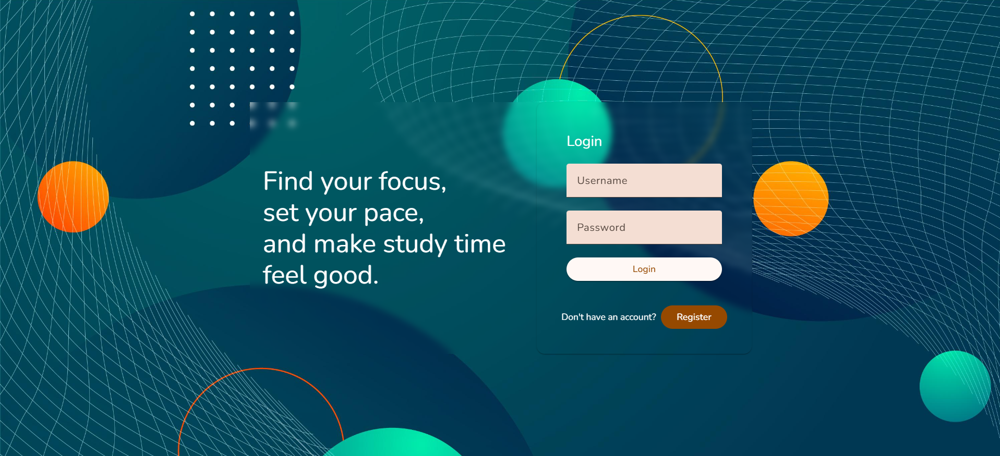
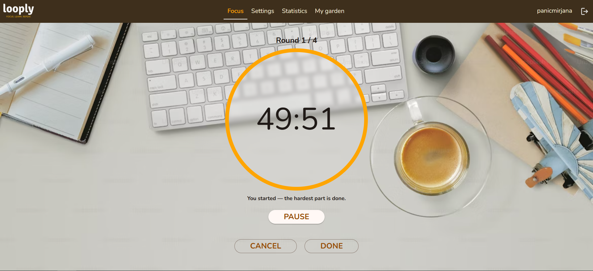
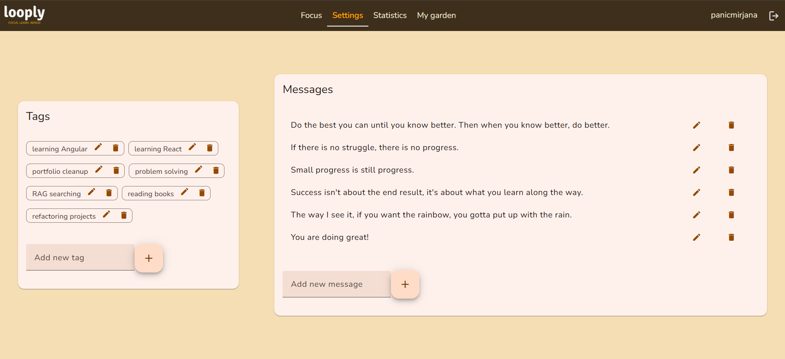
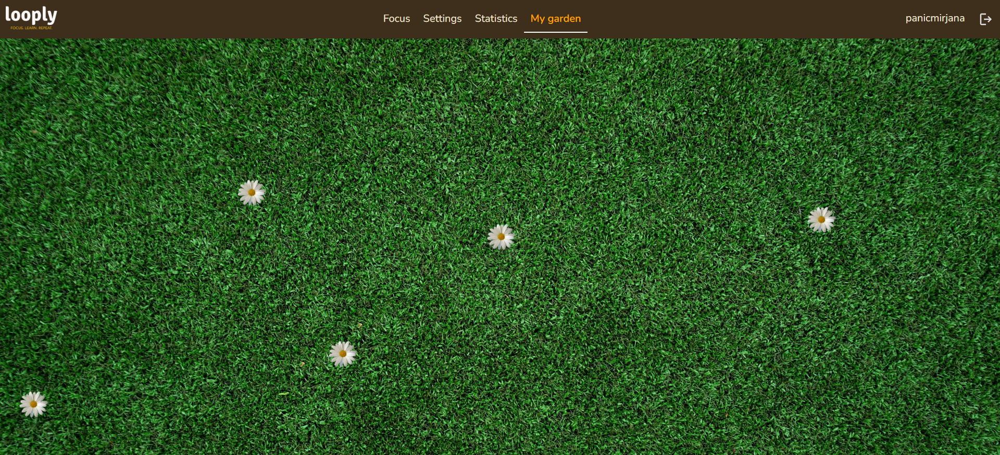

# Looply

A productivity web app that helps users stay focused and track their work sessions using a customizable round-based timer system.

## Features
- **Session setup** – manage tags and motivational messages (full CRUD)
- **Custom sessions** – configure round duration, number of rounds, and repetitions; optionally tag sessions for better organization
- **Session controls** – pause, resume, mark as done early, or cancel
- **Statistics** – weekly time report filtered by tags, visualized with Chart.js
- **Virtual garden** – earn a flower after each completed session and plant it anywhere on a virtual garden screen

## Tech Stack
**Frontend:** Angular, Angular Material, NgRx, RxJS, Chart.js, TypeScript  
**Backend:** NestJS, TypeORM, PostgreSQL, Passport.js, TypeScript

## Preview

### Login page


### Active session



### Session setup


### Virtual garden


## Getting Started

```bash
# Backend
cd backend
npm install
npm start

# Frontend
cd frontend
npm install
ng serve
```
